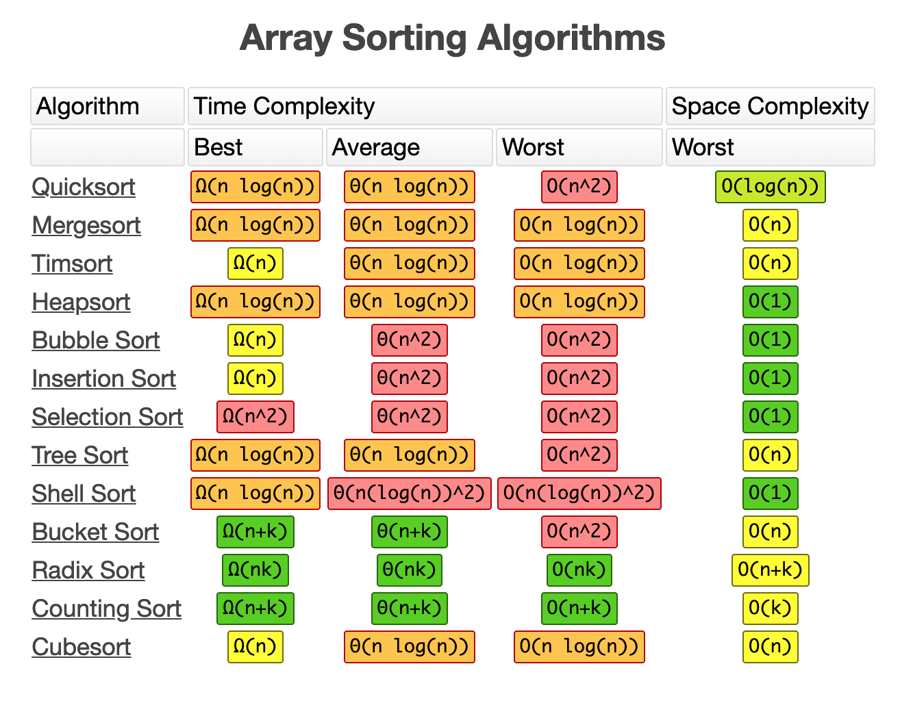
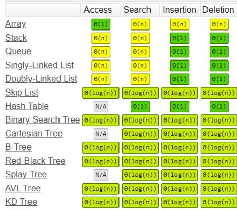

# DSA using Python

**[YouTube tutorial playlist](https://www.youtube.com/playlist?list=PLeo1K3hjS3uu_n_a__MI_KktGTLYopZ12)** that I followed

## Big O

Big O analysis of some common DSA

## Static Arrays

It can store a fixed number of elements at subsequent memeory locations.

## Dynamic Arrays

**Ex : List in Python**

1. Location for `N` elements is created.
2. When elements exceed `N`, a location for `2N` elements is created and old elements copied to it.
3. When elements exceed `2N`, a location for `3N` elements is created and old elements copied to it.

and so on...

## Linked List

**Ex : Deque of Collections in Python**

Each node (element) points to the next node (also the previous node in case of doubly linked list). Nodes do not need to be present in subsequent memory locations.

## Hash Table

**Ex : Dictionary in Python**

Used with key-value pairs where each key passed through a hashing algorithm gives the memory location where the value is stored.

For different keys with same hash (collision):

1. Chaining : Multiple values stored in an array along with their keys in the same location.
2. Linear Probing : Go forward until the next empty location is found, store the keys too.

## Stack

Last in first out (LIFO)

## Queue

First in first out (FIFO)

## General Tree

Elements are stored in a hierarchial model where each element can have child elements and parent element.

## Binary Search Tree

Max 2 child elements. Element on left is less than parent. Element on right is greater than parent.